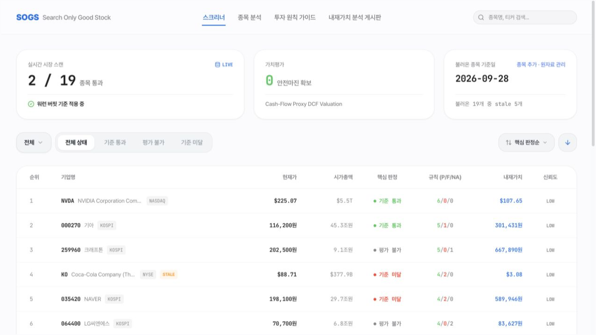
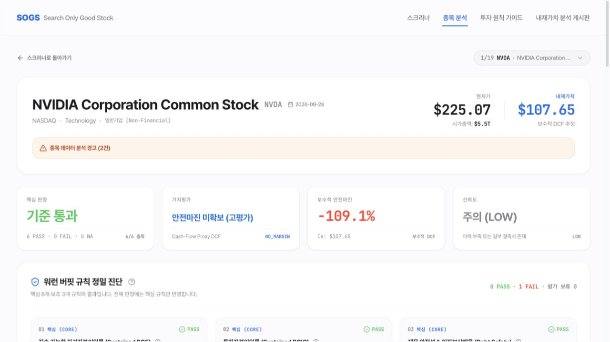
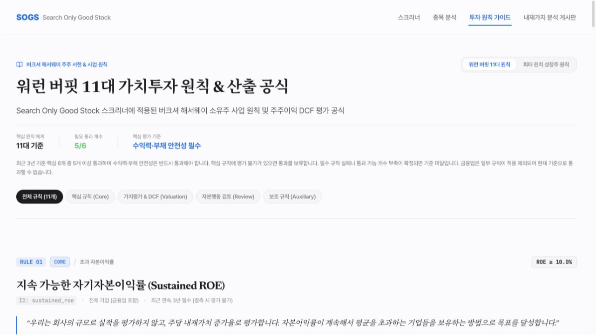
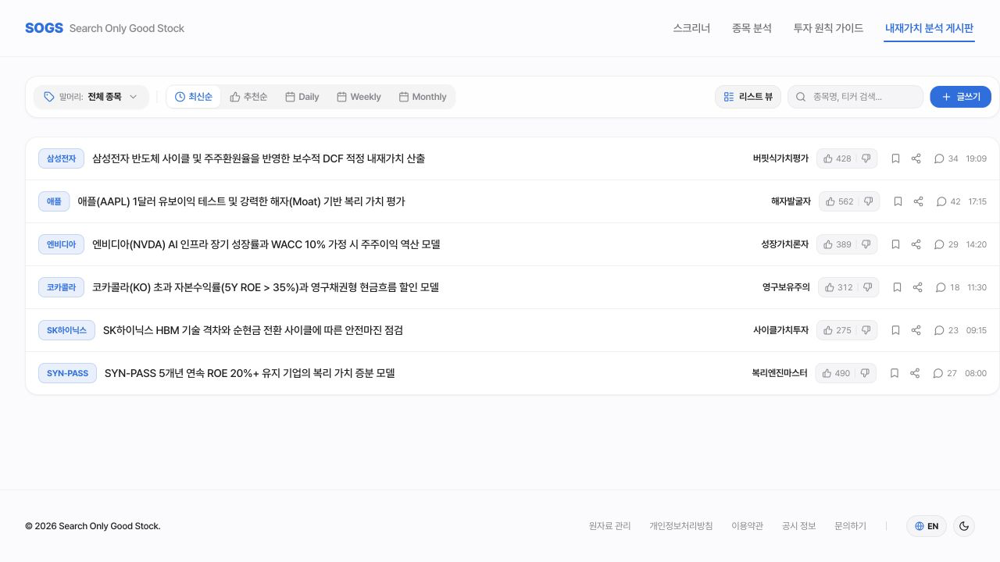

# search-only-good-stock (Frontend)

워런 버핏의 가치투자 기준을 바탕으로 좋은 주식을 발굴하고 분석하는 **React 프론트엔드(FE)** 프로젝트입니다.
국내·미국 종목을 검색하고, 투자 기준 충족 여부와 현금흐름 기반 DCF 추정가치를 비교할 수 있습니다.
투자 원칙 가이드와 내재가치 분석 게시판을 통해 평가 기준을 이해하고 투자 의견을 살펴볼 수 있습니다.

## 🖥️ 주요 화면

한국어·라이트 모드의 실제 실행 화면입니다. 종목 가격과 평가 결과는 캡처 당시 데이터 기준입니다.

### 스크리너

종목명·티커 검색과 시장·핵심 판정 필터로 종목을 탐색하고, 현재가·내재가치·신뢰도를 한눈에 비교합니다.



### 종목 상세 분석

종목별 투자 기준 진단, DCF 추정가치와 안전마진, 연차 재무정보를 확인합니다. 아래는 엔비디아(NVDA)의 분석 요약입니다.



### 투자 원칙 가이드

워런 버핏·피터 린치의 투자 원칙과 산출 공식을 살펴봅니다. 버핏 가이드에서는 핵심·가치평가·보조 규칙별 판정 기준을 설명합니다.



### 커뮤니티 · 내재가치 분석 게시판

종목별 투자 의견과 내재가치 분석 글을 검색하고 최신순·추천순으로 탐색합니다. 현재 게시판은 앱에 내장된 예시 게시글과 브라우저 로컬 저장 기능을 사용합니다.



---

## 📌 프로젝트 아키텍처 및 저장소 분리

본 서비스는 백엔드(BE)와 프론트엔드(FE)가 별도 저장소/폴더로 분리되어 운영됩니다.

- **Backend (BE)**: `search-only-good-stock`
  - **기술 스택**: Python, FastAPI, `uv`, Pydantic
- **Frontend (FE)**: `search-only-good-stock-fe` (현재 프로젝트)
  - **기술 스택**: React, Vite, TypeScript, Tailwind CSS

---

## 🚀 Frontend 빠른 시작

### 1. 패키지 설치
```bash
npm install
```

### 2. 백엔드 주소 설정

`.env.local`에 백엔드 API 주소를 설정합니다.

```dotenv
VITE_API_URL=http://localhost:8000
```

### 3. 로컬 개발 서버 실행

```bash
npm run dev
# 기본 주소: http://localhost:5173
```

종목 목록과 상세 분석을 보려면 데이터가 준비된 백엔드가 실행 중이어야 합니다.

### 4. 프로덕션 빌드 및 로컬 미리보기

```bash
npm run build
npm run preview
```

---

## 🔗 백엔드(BE) 연동 안내

- 백엔드(`search-only-good-stock`) 기본 주소: `http://localhost:8000`
- 환경변수: `.env.local`에 `VITE_API_URL=http://localhost:8000` 설정
- 프론트엔드-백엔드 타입 계약은 `src/types/openapi.generated.ts`를 기준으로 관리합니다.
- 백엔드 실행 방법은 [백엔드 개발 가이드](docs/dev/backend.md)를 참고하세요.

---

## 📖 개발 지침

자세한 AI/Agent 및 개발 가이드라인은 [AGENTS.md](AGENTS.md) 및 [프론트엔드 개발 가이드](docs/dev/frontend.md)를 참고하세요.
