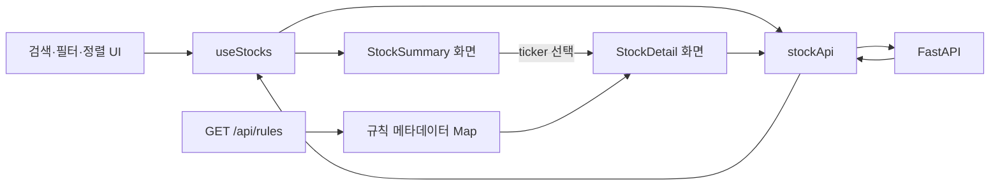

# 최신 주식 분석 API 기반 FE-BE 연동 설계서

> 문서 상태: 1차 구현 설계
>
> 대상 저장소: `search-only-good-stock-fe`(FE), `search-only-good-stock`(BE)
>
> 계약 기준일: 2026-08-28

## 1. 목적, 기준과 범위

### 1.1 목적

현재 FE는 `VITE_API_URL`과 API 호출 코드를 갖고 있지만 구형 `Stock` Mock DTO에
의존하고 있어 최신 BE 응답을 화면에서 사용할 수 없습니다. 이 문서는 이미 구현된
Fixture 기반 주식 분석 API를 FE 스크리너와 상세 화면에 연결하기 위한 계약, 화면
전환 순서와 완료 조건을 정의합니다.

1차 연동의 목표는 다음과 같습니다.

- `GET /api/stocks`의 페이지 응답을 스크리너에 표시합니다.
- `GET /api/stocks/{ticker}`의 규칙 평가와 DCF 결과를 상세 화면에 표시합니다.
- `GET /api/rules`의 규칙 정의를 규칙명·기본 기준 표시의 원본으로 사용합니다.
- API 실패를 Mock 데이터로 숨기지 않고 사용자에게 재시도 가능한 상태로 표시합니다.
- BE에 없는 값을 FE에서 추정하거나 구형 Mock 값으로 보충하지 않습니다.

### 1.2 설계 원본 우선순위

설계와 구현 내용이 충돌하면 다음 순서로 판단합니다.

1. BE OpenAPI의 현재 공개 스키마와 `app/schemas/api.py`
2. [워런 버핏 규칙 기반 백엔드 단계별 설계서](backend_design.md)
3. 이 문서의 FE 상태·표시·전환 결정
4. [프론트엔드 개발 가이드](frontend.md)
5. 구형 [FE-BE 인터페이스 명세서](frontend_be_integration_spec.md)

구형 명세서와 FE Mock의 `buffettScore`, `isMasterPass`, `nameKo`,
`priceChangePct`, `oneDollarTest` 계약은 최신 API의 원본이 아닙니다. BE에 호환
필드를 추가하지 않으며 FE가 최신 계약으로 이동합니다.

### 1.3 1차 구현 범위

- 주식 목록 조회, 검색, 시장·상태 필터, 정렬과 페이지 이동
- 종목 상세 조회와 9개 일반 규칙, 자본행동 검토, Owner Earnings DCF 표시
- 규칙 메타데이터 조회와 평가 결과의 이름·임계값 결합
- 로딩, 빈 결과, 404, 통신 실패와 재시도 UI
- 개발 환경의 API 주소와 CORS Origin 일치
- 기존 주식 화면의 `MOCK_STOCKS`, `useRuleEngine` 의존 제거

### 1.4 제외 범위

- 실시간 가격, 일일 등락률, 1년·5년 주가 차트
- 한글·영문 종목명 분리와 현지화된 기업명
- 경제적 해자, 경영진·이사회, 보수와 자본배치 정성 데이터
- 시장지수·국채금리 실시간 카드
- 커뮤니티 API, 인증·인가와 사용자별 규칙 저장
- 임계값을 FE에서 바꾸어 재계산하는 커스텀 규칙 엔진
- OpenAPI 코드 생성기나 범용 상태관리 라이브러리 도입

제외 데이터가 필요한 컴포넌트는 1차 연동 화면에서 숨기거나 지원 예정 상태로
대체합니다. Fixture 종목에 실존 기업용 Mock 데이터를 섞어 표시하지 않습니다.

### 💡구현 규칙 후보

<details><summary>펼치기</summary>

> 최신 BE 공개 계약을 연동의 유일한 데이터 원본으로 사용합니다.

#### 1. 공개 DTO 우선

> *"FE는 BE에 없는 구형 필드를 생성하거나 Mock으로 보충하지 않는다."*

출처: [설계 원본 우선순위](#12-설계-원본-우선순위)

- **필터 목적**: 서로 다른 규칙과 기준일의 데이터가 한 화면에 섞이는 문제 방지
- **평가 기간**: 모든 주식 목록·상세 API 요청과 화면 렌더링
- **필터링 조건**:
  - **통과 기준 (Pass Criteria)**: 화면 값이 공개 DTO 필드 또는 명시된 표시 변환에서 유래
  - **탈락/제외 기준 (Exclusion Criteria)**: 누락 필드를 `0`, 임의 점수 또는 Mock 값으로 대체
- **용어 설명**: 공개 DTO는 FastAPI 응답 모델이 외부에 직렬화한 camelCase JSON입니다.
- **데이터 출처**: BE OpenAPI와 `app/schemas/api.py`

</details>

---

## 2. 현재 상태와 해결할 계약 차이

### 2.1 현재 호출 흐름

- FE `src/services/api.ts`는 `VITE_API_URL`을 읽어 `/api/stocks`와
  `/api/stocks/{tickerOrId}`를 호출합니다.
- 목록 함수는 응답 전체를 `Stock[]`로 단언하지만 BE는 페이지 객체를 반환합니다.
- 통신 실패, CORS 실패와 응답 오류가 발생하면 `MOCK_STOCKS`를 자동 반환합니다.
- `App.tsx`, `StockDetailPage.tsx`의 선택 종목과 상세 드롭다운도
  `MOCK_STOCKS`를 직접 사용합니다.
- `useStocks.ts`는 구형 지표를 `useRuleEngine`으로 다시 계산하고 정렬합니다.

따라서 현재는 BE가 정상이어도 목록 응답의 `items`를 사용하지 못하며, 상세
응답은 구형 `Stock` 필드가 없어 렌더링 단계에서 실패합니다. 자동 Mock 대체로 인해
사용자는 실제 연동 성공 여부도 구분할 수 없습니다.

### 2.2 계약 차이

| 영역 | 현재 FE 기대값 | 최신 BE 계약 | 전환 결정 |
|---|---|---|---|
| 목록 최상위 | `Stock[]` | `{items,total,limit,offset}` | `StockListResponse`를 그대로 수신 |
| 종목명 | `nameKo`, `nameEn` | `name` | 1차에서는 `name` 하나만 표시 |
| 종합 판정 | 점수와 `isMasterPass` | `coreStatus` | `PASS/FAIL/N/A` 배지 표시 |
| 개수 | `passCount/totalRuleCount` | pass/fail/N/A 개수 | 세 상태를 함께 표시 |
| 개별 규칙 | `passed: boolean` | `status: PASS/FAIL/N/A` | N/A를 실패와 구분 |
| 가치평가 | 구형 FCF 카드 | Owner Earnings DCF | `dcf` 계약으로 카드 재구성 |
| 1달러 테스트 | 별도 객체 | `retained_value_test` 평가 | 일반 규칙 평가로 표시 |
| 가격 추세 | 일일 등락·sparkline | 제공하지 않음 | 관련 UI 숨김 |
| 정성 정보 | moat/governance | 제공하지 않음 | 관련 UI 숨김 |
| 오류 | Mock 자동 대체 | HTTP 오류 | 명시적 오류와 재시도 |

### 2.3 개발 주소와 CORS

로컬 개발 기준 주소는 다음 하나로 통일합니다.

| 구분 | 값 |
|---|---|
| FE | `http://localhost:5173` |
| BE | `http://localhost:8000` |
| FE 환경변수 | `VITE_API_URL=http://localhost:8000` |
| BE 환경변수 | `SOGS_CORS_ORIGINS=["http://localhost:5173"]` |

브라우저 Origin 비교에서 `localhost`와 `127.0.0.1`은 서로 다릅니다. 두 주소를
혼용하지 않습니다. 다른 Origin이 실제로 필요할 때만 `SOGS_CORS_ORIGINS`에
정확한 주소를 추가합니다.

현재 로컬 BE `.env`의 `CORS_ORIGINS` 키는 `Settings`의 `SOGS_` 접두사 정책과
맞지 않아 읽히지 않습니다. 기본값에 `localhost:5173`이 포함되어 있어 문제가
가려질 수 있으므로 F0에서 키를 `SOGS_CORS_ORIGINS`로 맞춥니다.

### 💡구현 규칙 후보

<details><summary>펼치기</summary>

> API 장애와 계약 불일치를 성공처럼 보이게 하지 않습니다.

#### 1. 묵시적 Mock 대체 금지

> *"실제 API 모드의 실패는 오류 상태로 전달하고 Mock 목록을 반환하지 않는다."*

출처: [현재 호출 흐름](#21-현재-호출-흐름)

- **필터 목적**: 개발·운영 중 연동 장애를 조기에 발견하고 잘못된 분석 데이터 표시 방지
- **평가 기간**: API 요청 시작부터 성공·실패 상태가 화면에 반영될 때까지
- **필터링 조건**:
  - **통과 기준 (Pass Criteria)**: 실패 원인이 UI 오류 상태와 개발자 로그에 남음
  - **탈락/제외 기준 (Exclusion Criteria)**: `catch`에서 `MOCK_STOCKS` 또는 임의 종목 반환
- **용어 설명**: 묵시적 fallback은 사용자의 선택 없이 다른 데이터 원본으로 바꾸는 동작입니다.
- **데이터 출처**: HTTP 상태 코드와 네트워크 오류

</details>

---

## 3. 목표 계약과 FE 데이터 계층

### 3.1 목표 흐름



FE 데이터 계층은 다음 세 책임만 분리합니다.

| 모듈 | 책임 |
|---|---|
| `src/types/api.ts` | 공개 JSON과 동일한 TypeScript DTO·열거형 |
| `src/services/api.ts` | URL과 쿼리 생성, HTTP 상태 검사, JSON 반환 |
| `src/hooks/useStocks.ts` | 요청 상태, 필터, 페이지와 오래된 요청 취소 |

범용 Repository, 클래스형 API SDK, 전역 스토어는 추가하지 않습니다. 표시용
문구·퍼센트·통화 포맷은 컴포넌트 또는 작은 순수 포맷 함수가 담당합니다. DTO에
표시 전용 필드를 덧붙이지 않습니다.

### 3.2 공통 타입

`src/types/api.ts`에 BE 열거형과 공개 응답을 수동으로 동일하게 정의합니다. 1차
연동 규모에서는 코드 생성 도구를 추가하지 않고, OpenAPI 계약 테스트와 TypeScript
빌드로 동기화를 확인합니다.

```typescript
export type Market = 'NASDAQ' | 'NYSE' | 'KOSPI' | 'KOSDAQ';
export type Currency = 'USD' | 'KRW';
export type CoreStatus = 'PASS' | 'FAIL' | 'N/A';
export type RuleStatus = 'PASS' | 'FAIL' | 'N/A';
export type ValuationStatus =
  | 'PASS_WITH_MARGIN'
  | 'WATCH'
  | 'NO_MARGIN'
  | 'N/A';
export type Confidence = 'HIGH' | 'MEDIUM' | 'LOW';
export type SourceType = 'FIXTURE';

export interface StockSummaryDTO {
  id: string;
  ticker: string;
  name: string;
  market: Market;
  sector: string;
  currency: Currency;
  currentPrice: number | null;
  marketCap: number | null;
  coreStatus: CoreStatus;
  corePassCount: number;
  coreFailCount: number;
  coreNaCount: number;
  valuationStatus: ValuationStatus;
  conservativeIntrinsicValue: number | null;
  conservativeMarginOfSafety: number | null;
  confidence: Confidence;
  dataAsOf: string;
  sourceType: SourceType;
}

export interface StockListResponse {
  items: StockSummaryDTO[];
  total: number;
  limit: number;
  offset: number;
}
```

상세 타입은 `StockDetailDTO extends StockSummaryDTO`로 정의하고 아래 BE 모델과
필드·null 허용 여부를 그대로 옮깁니다.

| FE 타입 | BE 원본 |
|---|---|
| `RuleDefinitionDTO`, `RuleListResponse` | `RuleDefinitionDTO`, `RuleListResponse` |
| `AnnualFinancialDTO` | `AnnualFinancialInput` |
| `QuarterlyBookPriceDTO` | `QuarterlyBookPriceInput` |
| `BenchmarkPointDTO`, `CurrentMarketDTO` | 대응 Input 모델 |
| `MetricValueDTO`, `RuleEvaluationDTO` | 대응 rule result 모델 |
| `CapitalActionEvaluationDTO` | 대응 capital action 모델 |
| `DcfScenarioDTO`, `DcfResultDTO` | 대응 DCF 모델 |
| `StockDetailDTO` | `StockDetailDTO` |

공개 JSON은 camelCase, 날짜·일시는 ISO 8601 문자열, 비율은 `0.15 = 15%`인
소수 비율입니다. `null`은 데이터 없음이며 `0`으로 치환하지 않습니다.

### 3.3 목록 요청 계약

```typescript
export interface StockListQuery {
  search?: string;
  market?: Market;
  sector?: string;
  coreStatus?: CoreStatus;
  valuationStatus?: ValuationStatus;
  sort?: 'ticker' | 'currentPrice' | 'conservativeMarginOfSafety';
  order?: 'asc' | 'desc';
  limit?: number;
  offset?: number;
}
```

- 쿼리는 `URLSearchParams`로 생성하여 문자열 결합과 누락된 인코딩을 피합니다.
- `undefined`와 빈 검색어는 전송하지 않습니다.
- `limit`은 1~200, `offset`은 0 이상으로 FE 컨트롤에서도 제한합니다.
- 시장 UI는 1차에서 `ALL/NASDAQ/NYSE/KOSPI/KOSDAQ`으로 구성합니다. BE가 단일
  `market`만 받으므로 `US/KR` 그룹을 위해 여러 요청을 합치는 로직은 추가하지
  않습니다.
- 검색은 300ms debounce 후 서버의 `search` 파라미터로 전달합니다.
- 다음 페이지는 기존 필터·정렬을 유지하고 `offset + items.length`로 요청합니다.

### 3.4 서비스 오류 계약

`stockApi`는 다음 함수만 제공합니다.

```typescript
getRules(signal?: AbortSignal): Promise<RuleListResponse>
getStocks(query: StockListQuery, signal?: AbortSignal): Promise<StockListResponse>
getStockDetail(ticker: string, signal?: AbortSignal): Promise<StockDetailDTO>
```

- 2xx가 아니면 응답의 `detail`을 읽어 일반 `Error`로 전달합니다.
- 상세 경로의 ticker는 `encodeURIComponent`로 인코딩합니다.
- 이전 검색·필터 요청은 `AbortController`로 취소하고 취소 오류는 사용자 오류로
  표시하지 않습니다.
- JSON 모양을 구형 `Stock`으로 변환하거나 필드를 합성하지 않습니다.
- 민감 값, 전체 상세 payload와 내부 스택을 로그로 출력하지 않습니다.

### 💡구현 규칙 후보

<details><summary>펼치기</summary>

> 전송 DTO와 표시 상태를 분리하고 API의 null·상태 의미를 보존합니다.

#### 1. 손실 없는 계약 매핑

> *"camelCase 공개 DTO를 그대로 수신하고 PASS, FAIL, N/A와 null을 서로 다른 값으로 유지한다."*

출처: [공통 타입](#32-공통-타입)

- **필터 목적**: 평가 불가를 실패로, 데이터 없음을 0으로 오인하는 문제 방지
- **평가 기간**: 목록 요약 수신부터 상세 규칙·DCF 렌더링까지
- **필터링 조건**:
  - **통과 기준 (Pass Criteria)**: DTO 열거형·nullable 필드가 OpenAPI와 일치
  - **탈락/제외 기준 (Exclusion Criteria)**: boolean 판정 축소, null의 0 치환, snake_case 혼용
- **용어 설명**: N/A는 기준 미달이 아니라 필요한 자료나 적용 가능성이 부족한 상태입니다.
- **데이터 출처**: `app/schemas/api.py`, `app/schemas/rule_results.py`

</details>

---

## 4. 화면 전환 설계

### 4.1 애플리케이션 종목 선택

`App.tsx`는 선택 종목의 전체 Mock 객체를 보관하지 않고 `selectedTicker`만
보관합니다. 목록 행·카드 선택 시 ticker를 전달하고 상세 페이지가 해당 ticker로
API를 조회합니다.

- 초기 선택 종목을 `aapl`로 고정하지 않습니다.
- 사용자가 목록에서 선택하기 전에는 상세 탭을 빈 안내 상태로 둘 수 있습니다.
- 직접 상세 진입이 필요하면 유효한 ticker를 URL 또는 상태에서 받아 조회합니다.
- 상단 내비게이션에 종목 정보가 필요하면 현재 목록의 `StockSummaryDTO`를 사용하며
  찾지 못한 경우 ticker만 표시합니다.

### 4.2 스크리너

`useStocks`의 구형 `Stock[]`와 `useRuleEngine` 계산을 제거하고 서버 결과를
그대로 관리합니다.

```text
idle/loading -> success(items 또는 empty)
             -> error(message, retry)
success + 다음 페이지 요청 -> 기존 items 유지 + loadingMore
```

목록 화면은 다음 필드를 사용합니다.

| UI | API 필드 | 표시 규칙 |
|---|---|---|
| 종목 | `ticker`, `name`, `market`, `sector` | 이름 하나만 표시 |
| 가격 | `currentPrice`, `currency` | 통화 포맷, null은 `—` |
| 시가총액 | `marketCap`, `currency` | 축약 포맷, null은 `—` |
| 핵심 판정 | `coreStatus` | PASS/FAIL/N/A 세 배지 |
| 판정 개수 | pass/fail/N/A count | `통과 7 · 실패 0 · 평가불가 0` |
| 가치평가 | `valuationStatus` | 네 상태를 구분 |
| 안전마진 | `conservativeMarginOfSafety` | 100을 곱해 %, null은 `—` |
| 신뢰도 | `confidence` | HIGH/MEDIUM/LOW |
| 기준 정보 | `dataAsOf`, `sourceType` | 기준일과 Fixture 표시 |

`buffettScore`, 동적 점수 정렬, 6/6 마스터 판정, ROE·ROIC 평균 열,
1달러 테스트 열과 sparkline은 제거합니다. 하드코딩된 시장지수와 국채금리 카드는
1차 API 연동 영역과 분리하거나 숨깁니다.

전체 건수는 목록 응답의 `total`을 사용합니다. PASS 건수가 꼭 필요한 경우 같은
검색·시장 조건에 `coreStatus=PASS&limit=1`을 적용한 별도 목록 응답의 `total`을
사용합니다. 현재 페이지의 항목 수로 전체 PASS 건수를 추정하지 않습니다.

### 4.3 상세 화면

상세 화면은 하나의 `StockDetailDTO`와 규칙 정의 Map을 입력으로 받습니다.

| 영역 | 사용 데이터 |
|---|---|
| 헤더 | 요약 필드, `dataAsOf`, `sourceName`, `sourceType` |
| 핵심 요약 | `coreStatus`, 세 개의 core count, `confidence` |
| 규칙 진단 | `ruleEvaluations`와 `GET /api/rules` 메타데이터 |
| 자본행동 | `capitalAction` |
| 가치평가 | `dcf` 전체와 보수·기본·낙관 시나리오 |
| 연차 자료 | `annualFinancials` |
| 분기·벤치마크 | `quarterlyBookPrices`, `benchmarkPoints` |
| 경고 | 상세 최상위 `warnings`와 각 평가의 `warnings` |

규칙 카드는 `ruleId`로 메타데이터를 찾습니다. 메타데이터 조회가 실패해도 상세
평가 자체는 `ruleId`, 상태와 metric으로 표시하며, 이름은 `ruleId`를 읽기 좋은
형태로만 포맷합니다. 임계값을 FE에 중복 하드코딩하지 않습니다.

기존 컴포넌트 전환은 다음 책임 단위로 수행합니다.

- `Buffett6RuleDiagnosis`와 `BuffettRuleGrid`는 9개 일반 평가를 표시하는 규칙
  분석 컴포넌트로 교체합니다.
- `DcfIntrinsicValueCard`는 `dcf.method`, 세 시나리오, 현재가, 보수적 안전마진,
  신뢰도와 사유 코드를 표시하도록 변경합니다.
- `OneDollarRetainedCard`는 제거하고 `retained_value_test` 규칙 카드로 통합합니다.
- `YearlyFinancialsTable`은 API가 제공하는 원자료 열만 표시합니다.
- `CompanyProfileCard`, 해자·거버넌스·주가 추세 컴포넌트는 1차 화면에서 숨깁니다.
- 상세 종목 드롭다운은 `MOCK_STOCKS`가 아니라 목록 API의 summary를 사용합니다.

### 4.4 로딩, 빈 결과와 오류

- 최초 목록과 상세 로딩에는 기존 스켈레톤 또는 스피너를 표시합니다.
- 목록 `items=[]`는 정상 빈 결과이며 필터 초기화 동작을 제공합니다.
- 네트워크 오류와 5xx는 재시도 버튼이 있는 오류 상태로 표시합니다.
- 상세 404는 “종목을 찾을 수 없음”과 목록 이동 동작을 표시합니다.
- 422는 FE 쿼리 구성 오류이므로 일반 빈 결과로 처리하지 않고 개발자 로그에
  endpoint와 상태만 남깁니다.
- 이전 성공 데이터를 유지한 추가 페이지 실패는 목록 전체를 지우지 않고 하단에
  재시도 동작을 표시합니다.

### 💡구현 규칙 후보

<details><summary>펼치기</summary>

> 각 화면은 API가 제공한 분석 상태와 근거만 표시합니다.

#### 1. 근거 기반 분석 화면

> *"점수 하나로 축약하지 않고 핵심 상태, 개별 규칙, 사유 코드와 신뢰도를 함께 표시한다."*

출처: [상세 화면](#43-상세-화면)

- **필터 목적**: 종합 점수만으로 평가 불가·예외·데이터 품질을 숨기는 문제 방지
- **평가 기간**: API가 규칙별로 선택한 최근 완료 5년 → 3년 → 1년
- **필터링 조건**:
  - **통과 기준 (Pass Criteria)**: 상태, 사용 기간, metrics, reasonCodes, warnings를 확인 가능
  - **탈락/제외 기준 (Exclusion Criteria)**: 구형 6대 점수로 재계산하거나 N/A 카드를 누락
- **용어 설명**: `confidence`는 계산 결과의 데이터 충분성과 경고를 요약한 신뢰도입니다.
- **데이터 출처**: `ruleEvaluations`, `capitalAction`, `dcf`, `dataAsOf`

</details>

---

## 5. 구현 단계와 검증

### 5.1 Phase F0 — 환경과 계약 기준선

1. FE와 BE를 각각 `localhost:5173`, `localhost:8000`으로 실행합니다.
2. `.env.example`의 변수 이름과 실제 설정 접두사를 확인합니다.
3. 브라우저에서 `/health`, `/api/rules`, `/api/stocks`의 CORS 포함 정상 응답을
   확인합니다.
4. 현재 OpenAPI JSON을 계약 검증 기준으로 보관하되 생성 파일은 커밋하지 않습니다.

완료 조건:

- 브라우저 Origin에서 세 API가 CORS 오류 없이 응답합니다.
- 로컬 설정에 시크릿이나 임의의 공용 주소가 하드코딩되지 않습니다.
- **커밋 메시지**: `chore(frontend): align local api environment`
- **완료 처리 여부**: [x] 완료

### 5.2 Phase F1 — DTO와 API 서비스

1. `src/types/api.ts`에 공개 DTO를 정의합니다.
2. `src/services/api.ts`가 페이지 객체와 상세 DTO를 반환하도록 변경합니다.
3. 자동 Mock fallback을 제거하고 오류를 호출자에게 전달합니다.
4. `URLSearchParams`, ticker 인코딩과 `AbortSignal`을 적용합니다.

완료 조건:

- 목록 응답의 `items`, `total`, `limit`, `offset`이 손실 없이 전달됩니다.
- 상세의 N/A, null, reason code와 DCF 시나리오가 손실 없이 전달됩니다.
- 실패 요청이 Mock 성공 응답으로 바뀌지 않습니다.
- **커밋 메시지**: `refactor(frontend): adopt stock analysis api contract`
- **완료 처리 여부**: [x] 완료

### 5.3 Phase F2 — 스크리너 전환

1. `useStocks`를 서버 쿼리와 요청 상태 중심으로 변경합니다.
2. 목록 카드·테이블·드로어를 `StockSummaryDTO` 필드로 전환합니다.
3. 시장·상태 필터와 지원 정렬을 API 쿼리에 연결합니다.
4. 빈 결과, 오류, 재시도와 추가 페이지 로딩을 구현합니다.
5. 스크리너의 `useRuleEngine`과 `MOCK_STOCKS` 의존을 제거합니다.

완료 조건:

- `/api/stocks` 네트워크 응답의 6개 합성 종목이 표시됩니다.
- 검색, 단일 시장, `coreStatus`, `valuationStatus`, 세 정렬과 페이지 이동이 BE
  결과와 일치합니다.
- nullable 값과 N/A가 깨지거나 0·FAIL로 표시되지 않습니다.
- **커밋 메시지**: `feat(frontend): connect screener to stock api`
- **완료 처리 여부**: [ ] 미완료

### 5.4 Phase F3 — 상세 전환과 Mock 정리

1. App과 상세 선택 상태를 ticker 기반으로 변경합니다.
2. 상세 헤더, 규칙, 자본행동, DCF와 원자료 표를 최신 DTO로 전환합니다.
3. 규칙 메타데이터를 `ruleId`로 결합합니다.
4. BE에 없는 상세 컴포넌트를 숨기고 주식 화면의 `MOCK_STOCKS` 참조를 제거합니다.
5. 사용되지 않는 구형 `Stock`, 규칙 엔진과 Mock 타입·데이터를 삭제합니다.

완료 조건:

- 목록에서 모든 Fixture 종목의 상세로 이동하고 새로 조회할 수 있습니다.
- `SYN-PASS`, `SYN-FAIL`, `SYN-NA`, `SYN-FIN`, `SYN-DILUTE`,
  `SYN-BUYBACK`의 서로 다른 상태와 경고가 화면에서 구분됩니다.
- 존재하지 않는 ticker의 404 화면과 목록 복귀가 동작합니다.
- 주식 목록·상세 실행 경로에서 `MOCK_STOCKS`를 참조하지 않습니다.
- **커밋 메시지**: `feat(frontend): connect stock detail analysis`
- **완료 처리 여부**: [ ] 미완료

### 5.5 품질 명령과 수동 통합 시나리오

BE:

```bash
uv lock --check
uv run pytest
uv run ruff check .
uv run ruff format --check .
```

FE:

```bash
npm run lint
npm run build
```

필수 브라우저 시나리오:

1. BE 중지 상태에서 FE가 오류와 재시도를 표시합니다.
2. BE 시작 후 재시도하면 Fixture 목록이 표시됩니다.
3. `PASS`, `FAIL`, `N/A` 필터 결과가 API 응답과 일치합니다.
4. `SYN-PASS` 상세의 DCF 세 시나리오와 9개 규칙이 표시됩니다.
5. `SYN-NA`와 `SYN-FIN`의 N/A 사유가 실패가 아닌 평가 불가로 표시됩니다.
6. `SYN-DILUTE`와 `SYN-BUYBACK`의 자본행동 경고가 구분됩니다.
7. 새로고침과 빠른 검색 변경에서 오래된 요청 결과가 최신 결과를 덮지 않습니다.
8. 모바일과 데스크톱에서 긴 사유 코드와 null 표시가 레이아웃을 깨지 않습니다.

### 💡구현 규칙 후보

<details><summary>펼치기</summary>

> 대표 Fixture 시나리오로 화면의 상태 보존과 오류 처리를 검증합니다.

#### 1. 계약 중심 통합 검증

> *"모든 대표 상태와 실패 경로를 실제 HTTP 응답으로 확인한 뒤 연동을 완료한다."*

출처: [품질 명령과 수동 통합 시나리오](#55-품질-명령과-수동-통합-시나리오)

- **필터 목적**: 타입 빌드만 통과하고 실제 JSON·CORS·화면 상태가 실패하는 문제 방지
- **평가 기간**: F0 기준선부터 F3 상세 전환 완료까지
- **필터링 조건**:
  - **통과 기준 (Pass Criteria)**: 6개 Fixture, 404, 서버 중지와 재시도 시나리오 통과
  - **탈락/제외 기준 (Exclusion Criteria)**: Mock만으로 검증하거나 대표 N/A·경고 상태 누락
- **용어 설명**: 계약 검증은 endpoint, JSON 모양, 상태 의미와 화면 표시를 함께 확인합니다.
- **데이터 출처**: 실행 중인 FastAPI Fixture API와 브라우저 네트워크 응답

</details>

---

## 6. 최종 완료 체크리스트

- [ ] FE와 BE 개발 Origin이 일치하고 CORS 오류가 없다.
- [ ] FE DTO가 최신 OpenAPI의 camelCase와 nullable 계약을 반영한다.
- [ ] 목록 API의 페이지 객체와 모든 지원 쿼리를 사용한다.
- [ ] 상세 API의 규칙, 자본행동, DCF, 사유와 경고를 표시한다.
- [ ] 주식 화면에서 자동 Mock fallback과 `MOCK_STOCKS` 직접 참조가 없다.
- [ ] BE에 없는 값을 0, 점수, Mock 또는 추정값으로 표시하지 않는다.
- [ ] 로딩, 빈 결과, 404, 422, 네트워크·서버 오류를 구분한다.
- [ ] BE와 FE 품질 명령이 모두 성공한다.
- [ ] 필수 브라우저 통합 시나리오가 모바일·데스크톱에서 통과한다.

이 체크리스트의 완료는 Fixture 기반 분석 화면의 기술적 연동 완료를 의미합니다.
실데이터 수집 완료나 종목 매수·매도 추천을 의미하지 않습니다.

### 💡구현 규칙 후보

<details><summary>펼치기</summary>

> 연동 완료는 연결 성공이 아니라 계약, 상태, 오류와 데이터 출처가 모두 검증된 상태입니다.

#### 1. 출처가 드러나는 완료 기준

> *"모든 표시값의 API 출처와 기준일을 확인할 수 있을 때만 연동을 완료한다."*

출처: [최종 완료 체크리스트](#6-최종-완료-체크리스트)

- **필터 목적**: Fixture·Mock·실데이터를 혼동하거나 일부 화면만 연결된 상태의 조기 완료 방지
- **평가 기간**: 목록 진입부터 상세 조회와 오류 복구까지 전체 사용자 흐름
- **필터링 조건**:
  - **통과 기준 (Pass Criteria)**: API 출처, 기준일, 상태와 오류 경로를 화면에서 확인 가능
  - **탈락/제외 기준 (Exclusion Criteria)**: 숨은 fallback, 하드코딩된 분석값, 실패 상태 누락
- **용어 설명**: `sourceType=FIXTURE`는 현재 데이터가 합성 검증 자료임을 뜻합니다.
- **데이터 출처**: `sourceType`, `sourceName`, `dataAsOf`와 HTTP 응답 상태

</details>
