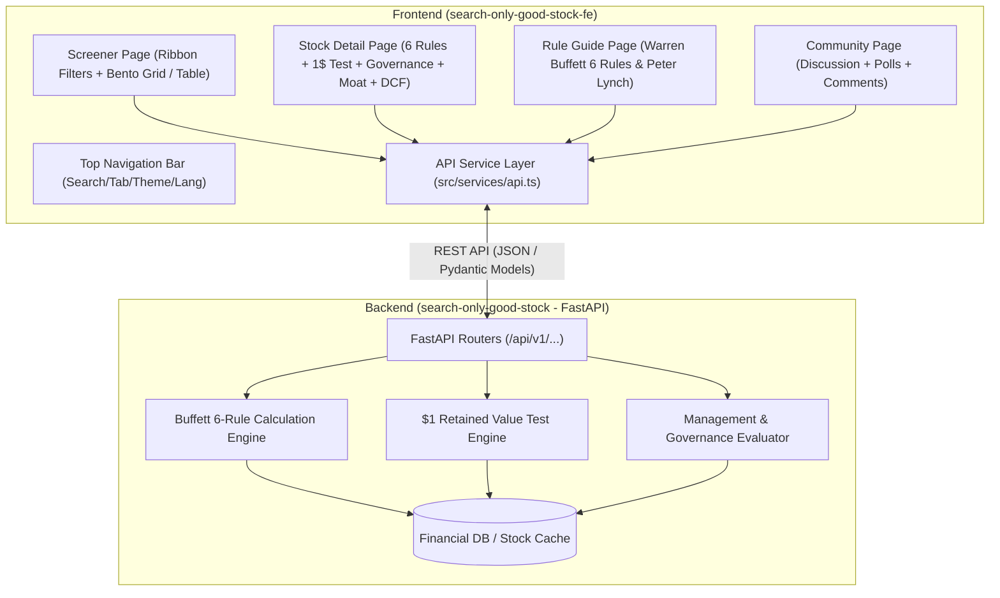
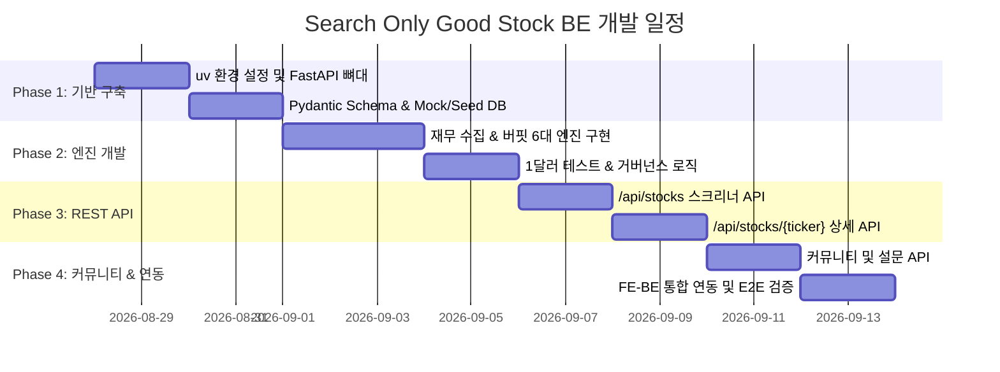

# 프론트엔드 구성 현황 및 백엔드(BE) 연동 인터페이스 명세서
> **Frontend-Backend Integration Specification & Architecture Guide**  
> 문서 버전: `1.0.0` | 대상 저장소: `search-only-good-stock` (BE) & `search-only-good-stock-fe` (FE)

---

## 1. 개요 및 시스템 아키텍처

본 문서는 **`search-only-good-stock-fe` (React + TypeScript + Vite + Tailwind CSS)** 1차 개발 완료 상태를 바탕으로, 향후 **`search-only-good-stock` (FastAPI + Python + `uv` + Pydantic + SQLAlchemy)** 백엔드를 개발할 때 필요한 전체 화면 구성, 데이터 모델, API 엔드포인트 명세, 지표 계산 엔진 로직을 AI 에이전트 및 백엔드 개발자가 즉시 이해하고 구현할 수 있도록 정리한 표준 기술 명세서입니다.



---

## 2. 프론트엔드 페이지별 구성 및 요구 데이터

프론트엔드는 애플(Apple) 특유의 인간 중심 디자인(Clarity, Deference, Depth, Tabular Precision)을 기반으로 총 4개의 핵심 탭 페이지와 컴포넌트들로 구현되어 있습니다.

### 2.1 스크리너 화면 (`ScreenerPage`)
- **컴포넌트**: `HorizontalRibbonFilter`, `StockCardGrid`, `WideStockTable`, `InlineStockExpansion`, `StockDetailDrawer`
- **핵심 기능**:
  - **프리셋 필터**: '워런 버핏 6대 원칙 마스터 (6/6 통과)', '해자 & 고수익 자본배치 (ROE 20%+)', '주주환원 & 주식 소각', '재무안정성 초우량 (무차입/고이자보상)'
  - **슬라이더/토글 커스텀 필터**:
    1. 5개년 평균 ROE (`>= 15%`)
    2. 5개년 평균 ROIC (`>= 10%`)
    3. 5개년 EPS CAGR (`>= 8%`)
    4. 5개년 BPS CAGR (`>= 8%`)
    5. 부채비율 (`<= 100%`) & 이자보상배율 (`>= 5배`)
    6. 1달러 유보이익 시장가치 창출 (`>= $1.0`)
    7. 5개년 발행주식수 CAGR (`<= 0%`, 주식 희석 방지/소각)
    8. 마스터 패스 전용 토글 (6개 규칙 모두 만족)
  - **보기 모드 전환**: 벤토 카드 그리드 뷰 vs 와이드 재무 테이블 뷰
  - **종목 검색**: 종목명(한/영), 티커, 섹터 실시간 검색

### 2.2 종목 상세 화면 (`StockDetailPage`)
- **컴포넌트**:
  - `StockHeader`: 현재가, 일일 등락률, 시가총액, 섹터, 버핏 스코어 뱃지, 마스터 패스 상태
  - `Buffett6RuleDiagnosis` & `BuffettRuleGrid`: 6대 원칙 통과/미달 상세 진단 카드 (실제값 vs 기준값)
  - `OneDollarTestWidget` & `OneDollarRetainedCard`: 5개년 누적 유보이익 vs 시가총액 증가분 비교 (창출가치/$)
  - `DcfIntrinsicValueCard`: 보수적 10년 잉여현금흐름(FCF) 기반 내재가치 및 안전마진(Margin of Safety)
  - `ManagementGovernanceSection` & `CapitalAllocationCookCard`:
    - 경영진 프로필(CEO, CFO, 사외이사), 재임기간, 보유주식수, 지분가치, 지분율
    - 경영진 보수 체계(기본급, 단기성과급, 장기주식보상 비중, 주주수익률 연동 평가)
    - 5개년 자본배치(자사주 매입/소각, 배당, R&D/CAPEX 재투자, M&A 비중)
    - 이사회 독립성(사외이사 비율 %) 및 거버넌스 등급 (A+, A, B, C)
  - `EconomicMoatSection`: 경제적 해자 요약 및 해자 원천 태그(전환비용, 네트워크 효과, 브랜드 등)
  - `FinancialTrendChart` & `YearlyFinancialsTable`: 5개년 연도별 재무제표(ROE, ROIC, EPS, BPS, 매출, 순이익, 영업이익률, 부채비율, 주가)

### 2.3 규칙 가이드 화면 (`RuleGuidePage`)
- **컴포넌트**: `BuffettGuide`, `PeterLynchGuide`
- **핵심 기능**:
  - 워런 버핏의 6대 핵심 투자 원칙 이론 배경, 계산 공식, 합격 기준 설명
  - 피터 린치의 PEG, 체력 지표, 6가지 기업 분류 가이드

### 2.4 커뮤니티 화면 (`CommunityPage`)
- **컴포넌트**: `DiscussionFeed`, `SentimentPollWidget`, `TopContributorsCard`
- **핵심 기능**:
  - 종목별 가치투자 토론글(Buffett, Lynch, 분석, 가치평가 카테고리)
  - 종목 투자 심리 투표(Sentiment Poll) 및 실시간 득표율 표시
  - 게시글 작성, 추천/비추천, 댓글 작성/좋아요 기능

---

## 3. 백엔드 REST API 엔드포인트 명세

백엔드(`FastAPI`)에서 제공해야 할 API 엔드포인트 스펙입니다.

### 3.1 종목 및 스크리닝 API

| HTTP Method | Endpoint | 설명 | Query Parameters / Request Body | Response DTO |
| :--- | :--- | :--- | :--- | :--- |
| `GET` | `/api/stocks` | 전체 종목 목록 또는 스크리닝 조건에 맞는 종목 리스트 조회 | `search`, `market`, `sector`, `minRoe`, `minRoic`, `minEpsCagr`, `minBpsCagr`, `maxDebtToEquity`, `minInterestCoverage`, `minOneDollarValue`, `maxShareCagr`, `isMasterPassOnly`, `sort`, `order` | `List[StockResponseDTO]` |
| `GET` | `/api/stocks/{tickerOrId}` | 특정 종목의 모든 상세 데이터(버핏진단, 재무추세, 거버넌스, 해자, DCF) 조회 | `tickerOrId` (Path param: e.g. `AAPL`, `MSFT`, `005930`) | `StockResponseDTO` |
| `GET` | `/api/stocks/{tickerOrId}/chart` | 종목의 기간별 주가 및 벤치마크 시계열 차트 데이터 조회 | `period` (`1y`, `5y`, `10y`, `max`) | `StockChartResponseDTO` |
| `GET` | `/api/stocks/{tickerOrId}/financials` | 종목의 다개년 연도별/분기별 재무제표 원본 데이터 조회 | `periodType` (`annual`, `quarter`) | `List[YearlyFinancialMetricDTO]` |

### 3.2 규칙 및 프리셋 메타데이터 API

| HTTP Method | Endpoint | 설명 | Response DTO |
| :--- | :--- | :--- | :--- |
| `GET` | `/api/rules` | 시스템에서 지원하는 전체 필터 규칙 정의 메타데이터 조회 | `List[FilterRuleDefinitionDTO]` |
| `GET` | `/api/rules/presets` | 미리 정의된 투자 대가별 필터 프리셋 목록 조회 | `List[RulePresetDTO]` |

### 3.3 커뮤니티 API

| HTTP Method | Endpoint | 설명 | Request Body / Response DTO |
| :--- | :--- | :--- | :--- |
| `GET` | `/api/community/posts` | 가치투자 토론 게시글 목록 조회 (필터/정렬) | Query: `category`, `sort`, `ticker`, `page`, `limit`<br>Response: `List[DiscussionPostDTO]` |
| `GET` | `/api/community/posts/{postId}` | 특정 토론글 상세 및 댓글 목록 조회 | Response: `DiscussionPostDetailDTO` |
| `POST` | `/api/community/posts` | 새로운 토론글 등록 | Body: `CreatePostRequestDTO`<br>Response: `DiscussionPostDTO` |
| `POST` | `/api/community/posts/{postId}/vote` | 게시글 추천/비추천 투표 | Body: `VoteRequestDTO` (`direction: "up" \| "down"`) |
| `POST` | `/api/community/posts/{postId}/comments`| 댓글 작성 | Body: `CreateCommentRequestDTO`<br>Response: `CommentDTO` |
| `GET` | `/api/community/polls` | 현재 진행 중인 투자 심리 설문 목록 조회 | Response: `List[SentimentPollDTO]` |
| `POST` | `/api/community/polls/{pollId}/vote` | 설문 옵션 투표 | Body: `PollVoteRequestDTO` (`optionId: string`) |

---

## 4. TypeScript ↔ FastAPI (Pydantic) DTO 모델 매핑

FE의 TypeScript 인터페이스(`src/types/`)와 백엔드 Pydantic V2 스키마 간의 1:1 매핑 정의입니다.

### 4.1 핵심 종목 DTO (`Stock` ↔ `StockResponseDTO`)

#### FE TypeScript (`src/types/stock.ts`)
```typescript
export interface Stock {
  id: string;                         // 'aapl'
  ticker: string;                     // 'AAPL'
  nameKo: string;                     // '애플'
  nameEn: string;                     // 'Apple Inc.'
  market: 'NASDAQ' | 'NYSE' | 'KOSPI' | 'KOSDAQ';
  sector: string;                     // '기술 / 소비자 전자제품'
  currentPrice: number;               // 227.63
  priceChangePct: number;             // 1.25 (%)
  currency: 'USD' | 'KRW';
  marketCap: number;                  // 34500 (억 달러 또는 원)
  marketCapFormatted: string;         // '$3.45T'

  // 버핏 6대 핵심 지표 요약
  buffettScore: number;               // 100 (0 ~ 100점)
  isMasterPass: boolean;              // true (6/6 통과)
  passCount: number;                  // 6
  totalRuleCount: number;             // 6

  avgRoe5Yr: number;                  // 147.2 (%)
  avgRoic5Yr: number;                 // 56.4 (%)
  epsCagr5Yr: number;                 // 15.3 (%)
  bpsCagr5Yr: number;                 // 11.2 (%)
  debtToEquity: number;               // 145.8 (%)
  interestCoverage: number;           // 38.5 (배)
  shareCountCagr5Yr: number;          // -3.8 (%) (마이너스 = 주식 소각)
  benchmarkBpsCagr5Yr: number;        // 8.5 (%)

  // 시계열 및 추세
  high52W: number;
  low52W: number;
  priceChange1YrPct?: number;
  sparkline1Yr: number[];             // [180.2, 185.4, ..., 227.63]
  sparkline5Yr: number[];
  yearlyFinancials: YearlyFinancialMetric[];

  // 1달러 유보이익 테스트 및 해자/거버넌스
  oneDollarTest: OneDollarTestResult;
  economicMoatSummary: string;
  moatSources: string[];
  governance: ManagementGovernance;
  ruleEvaluations: RuleEvaluationDetail[];
}
```

#### BE Pydantic V2 Model (`app/schemas/stock.py`)
```python
from pydantic import BaseModel, Field
from typing import List, Optional, Literal

class LeadershipMemberDTO(BaseModel):
    role: str
    name: str
    tenure_years: int = Field(..., serialization_alias="tenureYears")
    bio: str
    shares_owned: int = Field(..., serialization_alias="sharesOwned")
    shares_value_usd: float = Field(..., serialization_alias="sharesValueUsd")
    shares_ownership_pct: Optional[float] = Field(None, serialization_alias="sharesOwnershipPct")
    is_outside_director: Optional[bool] = Field(False, serialization_alias="isOutsideDirector")
    compensation_usd: Optional[float] = Field(None, serialization_alias="compensationUsd")
    base_salary_pct: Optional[float] = Field(None, serialization_alias="baseSalaryPct")
    performance_bonus_pct: Optional[float] = Field(None, serialization_alias="performanceBonusPct")
    stock_based_comp_pct: Optional[float] = Field(None, serialization_alias="stockBasedCompPct")
    other_comp_pct: Optional[float] = Field(None, serialization_alias="otherCompPct")
    other_comp_description: Optional[str] = Field(None, serialization_alias="otherCompDescription")

class ExecutiveCompensationDTO(BaseModel):
    year: int
    total_comp_usd: float = Field(..., serialization_alias="totalCompUsd")
    base_salary_pct: float = Field(..., serialization_alias="baseSalaryPct")
    performance_bonus_pct: float = Field(..., serialization_alias="performanceBonusPct")
    stock_based_comp_pct: float = Field(..., serialization_alias="stockBasedCompPct")
    other_comp_pct: Optional[float] = Field(None, serialization_alias="otherCompPct")
    other_comp_description: Optional[str] = Field(None, serialization_alias="otherCompDescription")
    alignment_rating: Literal['EXCELLENT', 'GOOD', 'CONCERNING'] = Field(..., serialization_alias="alignmentRating")
    summary_comment: str = Field(..., serialization_alias="summaryComment")

class CapitalAllocation5YrDTO(BaseModel):
    share_buybacks_pct: float = Field(..., serialization_alias="shareBuybacksPct")
    dividends_pct: float = Field(..., serialization_alias="dividendsPct")
    reinvestment_pct: float = Field(..., serialization_alias="reinvestmentPct")
    ma_acquisition_pct: float = Field(..., serialization_alias="maAcquisitionPct")
    total_shareholder_return_pct: float = Field(..., serialization_alias="totalShareholderReturnPct")

class ManagementGovernanceDTO(BaseModel):
    overall_grade: Literal['A+', 'A', 'B', 'C'] = Field(..., serialization_alias="overallGrade")
    grade_label: str = Field(..., serialization_alias="gradeLabel")
    ceo_skin_in_the_game_summary: str = Field(..., serialization_alias="ceoSkinInTheGameSummary")
    leadership: List[LeadershipMemberDTO]
    compensation: ExecutiveCompensationDTO
    capital_allocation: CapitalAllocation5YrDTO = Field(..., serialization_alias="capitalAllocation")
    board_independence_pct: float = Field(..., serialization_alias="boardIndependencePct")

class YearlyFinancialMetricDTO(BaseModel):
    year: int
    roe: float
    roic: float
    eps: float
    bps: float
    revenue: float
    net_income: float = Field(..., serialization_alias="netIncome")
    operating_margin: float = Field(..., serialization_alias="operatingMargin")
    debt_to_equity: float = Field(..., serialization_alias="debtToEquity")
    price: float

class OneDollarTestResultDTO(BaseModel):
    evaluation_period_years: int = Field(..., serialization_alias="evaluationPeriodYears")
    accumulated_retained_earnings: float = Field(..., serialization_alias="accumulatedRetainedEarnings")
    market_cap_increase: float = Field(..., serialization_alias="marketCapIncrease")
    value_created_per_dollar: float = Field(..., serialization_alias="valueCreatedPerDollar")
    passed: bool
    evaluation_comment: str = Field(..., serialization_alias="evaluationComment")

class RuleEvaluationDetailDTO(BaseModel):
    rule_id: str = Field(..., serialization_alias="ruleId")
    rule_name: str = Field(..., serialization_alias="ruleName")
    passed: bool
    actual_value: str | float | bool = Field(..., serialization_alias="actualValue")
    target_value: str | float | bool = Field(..., serialization_alias="targetValue")
    unit: Optional[str] = None
    comment: str

class StockResponseDTO(BaseModel):
    id: str
    ticker: str
    name_ko: str = Field(..., serialization_alias="nameKo")
    name_en: str = Field(..., serialization_alias="nameEn")
    market: Literal['NASDAQ', 'NYSE', 'KOSPI', 'KOSDAQ']
    sector: str
    current_price: float = Field(..., serialization_alias="currentPrice")
    price_change_pct: float = Field(..., serialization_alias="priceChangePct")
    currency: Literal['USD', 'KRW']
    market_cap: float = Field(..., serialization_alias="marketCap")
    market_cap_formatted: str = Field(..., serialization_alias="marketCapFormatted")

    buffett_score: int = Field(..., serialization_alias="buffettScore")
    is_master_pass: bool = Field(..., serialization_alias="isMasterPass")
    pass_count: int = Field(..., serialization_alias="passCount")
    total_rule_count: int = Field(6, serialization_alias="totalRuleCount")

    avg_roe_5yr: float = Field(..., serialization_alias="avgRoe5Yr")
    avg_roic_5yr: float = Field(..., serialization_alias="avgRoic5Yr")
    eps_cagr_5yr: float = Field(..., serialization_alias="epsCagr5Yr")
    bps_cagr_5yr: float = Field(..., serialization_alias="bpsCagr5Yr")
    debt_to_equity: float = Field(..., serialization_alias="debtToEquity")
    interest_coverage: float = Field(..., serialization_alias="interestCoverage")
    share_count_cagr_5yr: float = Field(..., serialization_alias="shareCountCagr5Yr")
    benchmark_bps_cagr_5yr: float = Field(..., serialization_alias="benchmarkBpsCagr5Yr")

    high_52w: float = Field(..., serialization_alias="high52W")
    low_52w: float = Field(..., serialization_alias="low52W")
    price_change_1yr_pct: Optional[float] = Field(None, serialization_alias="priceChange1YrPct")
    sparkline_1yr: List[float] = Field(..., serialization_alias="sparkline1Yr")
    sparkline_5yr: List[float] = Field(..., serialization_alias="sparkline5Yr")
    yearly_financials: List[YearlyFinancialMetricDTO] = Field(..., serialization_alias="yearlyFinancials")

    one_dollar_test: OneDollarTestResultDTO = Field(..., serialization_alias="oneDollarTest")
    economic_moat_summary: str = Field(..., serialization_alias="economicMoatSummary")
    moat_sources: List[str] = Field(..., serialization_alias="moatSources")
    governance: ManagementGovernanceDTO
    rule_evaluations: List[RuleEvaluationDetailDTO] = Field(..., serialization_alias="ruleEvaluations")

    class Config:
        populate_by_name = True
```

---

## 5. 백엔드 핵심 비즈니스 계산 엔진 (Buffett 6-Rule Engine)

백엔드에서 종목 데이터를 가공할 때 계산해야 하는 핵심 공식입니다.

### 5.1 워런 버핏 6대 핵심 지표 계산 공식
1. **5개년 평균 ROE (Return on Equity)**
   $$\text{Avg ROE}_{5\text{Yr}} = \frac{1}{5} \sum_{t=1}^{5} \left( \frac{\text{당기순이익}_t}{\text{자기자본}_t} \times 100 \right) \ge 15\%$$
2. **5개년 평균 ROIC (Return on Invested Capital)**
   $$\text{ROIC}_t = \frac{\text{NOPAT}_t}{\text{IC}_t} = \frac{\text{영업이익}_t \times (1 - \text{실효세율}_t)}{\text{총자산}_t - \text{비이자부유동부채}_t - \text{현금}} \ge 10\%$$
3. **5개년 EPS 및 BPS 연평균 복합 성장률 (CAGR)**
   $$\text{CAGR} = \left( \frac{\text{Value}_{t}}{\text{Value}_{t-5}} \right)^{\frac{1}{5}} - 1 \ge 8\%$$
   - 벤치마크(S&P500 / KOSPI) BPS 성장률 초과 검증
4. **1달러 유보이익 가치창출 테스트 ($1 Retained Earnings Test)**
   $$\text{Value Created Per Dollar} = \frac{\text{시가총액}_t - \text{시가총액}_{t-5}}{\sum_{k=t-4}^{t} (\text{당기순이익}_k - \text{배당금}_k)} \ge \$1.0$$
5. **재무 건전성 및 부채 안전성**
   - 부채비율: $\frac{\text{총부채}}{\text{자기자본}} \times 100 \le 100\%$ (단, 대규모 자사주 매입으로 자본이 감소한 고ROE 우량 기업은 예외 플래그 적용)
   - 이자보상배율: $\frac{\text{영업이익}}{\text{이자비용}} \ge 5\text{배}$
6. **주식수 희석 방지 (5개년 발행주식수 CAGR)**
   $$\text{Share Count CAGR}_{5\text{Yr}} = \left( \frac{\text{발행주식수}_t}{\text{발행주식수}_{t-5}} \right)^{\frac{1}{5}} - 1 \le 0\%$$
   - 0% 이하(마이너스)인 경우 주주지분 확대 및 적극적 자사주 소각 기업으로 판정

### 5.2 버핏 종합 스코어(0~100점) 산출식
- 기본 6개 규칙 각각에 가중치 부여 (ROE/ROIC: 30점, 성장성: 20점, 1달러 테스트: 20점, 재무건전성: 15점, 주식소각/환원: 15점)
- 6개 규칙을 모두 통과(`passCount === 6`)할 경우 `isMasterPass = True`, `buffettScore = 100` 부여.

---

## 6. 백엔드(`search-only-good-stock`) 구현 로드맵

백엔드 개발은 다음과 같이 4단계로 진행합니다.



1. **Phase 1: 기반 구축 및 스키마 확정**
   - `uv init`, `uv add fastapi uvicorn pydantic sqlalchemy httpx`
   - 본 명세서의 Pydantic V2 DTO 스키마 구현 (`app/schemas/`)
   - FE가 즉시 연동 테스트할 수 있는 기본 데이터 시드/목 API 서빙 (`GET /api/stocks`, `GET /api/stocks/{ticker}`)
2. **Phase 2: 재무 데이터 수집 및 6대 지표 계산 엔진**
   - Yahoo Finance / SEC EDGAR / DART(OpenDartReader) 또는 재무 DB 수집 파이프라인 구축
   - 5개년 ROE/ROIC, CAGR, 1달러 유보이익 테스트, 이자보상배율 자동 계산 엔진 모듈 구현 (`app/services/buffett_engine.py`)
3. **Phase 3: 종목 스크리닝 및 상세 정보 API 완성**
   - 다중 조건 필터링, 정렬, 페이징 지원 스크리너 엔드포인트
   - 내재가치(DCF), 거버넌스 및 자본배치 분석 데이터 서빙
4. **Phase 4: 커뮤니티/설문 API 및 FE-BE 최종 연동 검증**
   - SQLite / PostgreSQL 기반 토론글, 댓글, 투표 API
   - FE(`VITE_API_URL`)와 실시간 연동 테스트 및 CORS 설정

---

## 7. 결론 및 참고 사항
- **포맷 선택 이유**: AI 에이전트(LLM)와 개발자가 맥락을 가장 명확하게 파악하고, 코드 생성 시 프롬프트 및 컨텍스트로 주입하기에 최적화된 **GitHub Flavored Markdown (`.md`)** 형식을 채택했습니다.
- 백엔드 개발 시 본 문서의 필드 네이밍(`camelCase` 직렬화) 및 타입 제약을 준수하면, 프론트엔드 코드 수정 없이 100% 매끄러운 통신이 가능합니다.
